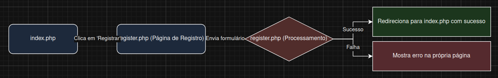
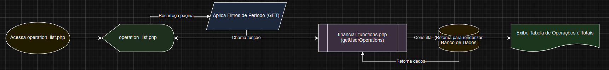
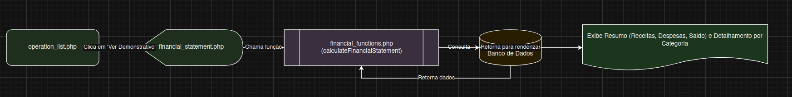

# Documentação dos Fluxos da Aplicação de Gestão Financeira

Este documento descreve os principais fluxos de interação do usuário com o sistema, com base no diagrama `fluxos_detalhados.drawio`.

## 1. Fluxo de Login

Este fluxo descreve como um usuário existente acessa o sistema.

1.  **Início**: O usuário acessa a aplicação, sendo direcionado para a página `index.php`.
2.  **Página de Login**: O formulário em `index.php` coleta o e-mail e a senha do usuário.
3.  **Processamento**: Os dados são enviados para `login_process.php`, que valida as credenciais contra o banco de dados.
4.  **Resultado**:
    *   **Sucesso**: Se as credenciais estiverem corretas, o usuário é autenticado e redirecionado para a página principal do sistema, `operation_list.php`.
    *   **Falha**: Em caso de falha, o usuário é redirecionado de volta para `index.php` com uma mensagem de erro.

## 2. Fluxo de Cadastro de Usuário

Este fluxo permite que um novo usuário crie uma conta no sistema.

1.  **Início**: Na página de login (`index.php`), o usuário clica no link para se registrar.
2.  **Página de Registro**: Ele é levado para `register.php`, onde preenche um formulário com e-mail e senha.
3.  **Processamento**: O formulário é submetido à própria página (`register.php`), que valida os dados (ex: se o e-mail já existe, se as senhas coincidem).
4.  **Resultado**:
    *   **Sucesso**: Um novo registro de usuário é criado no banco de dados, e o usuário é redirecionado para `index.php` com uma mensagem de sucesso, podendo então realizar o login.
    *   **Falha**: Se houver um erro de validação, a página `register.php` é recarregada com uma mensagem indicando o problema.

## 3. Fluxo de Geração de Operação Financeira

Este fluxo detalha como um usuário autenticado registra uma nova receita ou despesa.

1.  **Início**: A partir do `dashboard.php` ou da lista de operações (`operation_list.php`), o usuário clica no botão "Nova Operação".
2.  **Formulário de Criação**: O usuário é direcionado para `operation_create.php`, onde preenche os detalhes da transação (tipo, categoria, valor, data).
3.  **Processamento**: O formulário é submetido à própria página (`operation_create.php`), que valida os dados e os insere na tabela de operações financeiras no banco de dados.
4.  **Resultado**:
    *   **Sucesso**: A operação é salva, e o usuário é redirecionado para `operation_list.php` com uma mensagem de confirmação.

## 4. Fluxo de Listagem de Operações Financeiras

Este fluxo mostra como o usuário visualiza suas transações registradas.

1.  **Início**: O usuário acessa `operation_list.php` (normalmente após o login ou ao navegar pelo menu).
2.  **Filtragem (Opcional)**: O usuário pode usar os filtros de data na página para definir um período específico. Ao aplicar o filtro, a página é recarregada com os novos parâmetros.
3.  **Busca de Dados**: A página chama a função `getUserOperations()` (em `includes/financial_functions.php`) para buscar as operações do usuário no banco de dados, de acordo com o período selecionado.
4.  **Exibição**: Os dados retornados são renderizados em uma tabela, mostrando detalhes de cada operação. Além disso, são exibidos cartões com os totais de receitas, despesas e o saldo do período.

## 5. Fluxo de Geração de Demonstrativo Financeiro

Este fluxo permite que o usuário veja um resumo consolidado de sua situação financeira.

1.  **Início**: Na página de listagem (`operation_list.php`), o usuário clica no botão "Ver Demonstrativo". Os filtros de período ativos são passados para a próxima página.
2.  **Página de Demonstrativo**: O usuário é levado para `financial_statement.php`.
3.  **Cálculo dos Dados**: A página chama a função `calculateFinancialStatement()` (em `includes/financial_functions.php`), que consulta o banco de dados para agregar todas as receitas e despesas do período.
4.  **Exibição**: A página exibe um resumo financeiro claro, incluindo:
    *   Total de receitas.
    *   Total de despesas.
    *   Saldo final (lucro ou prejuízo).
    *   Um detalhamento dos totais agrupados por categoria.
